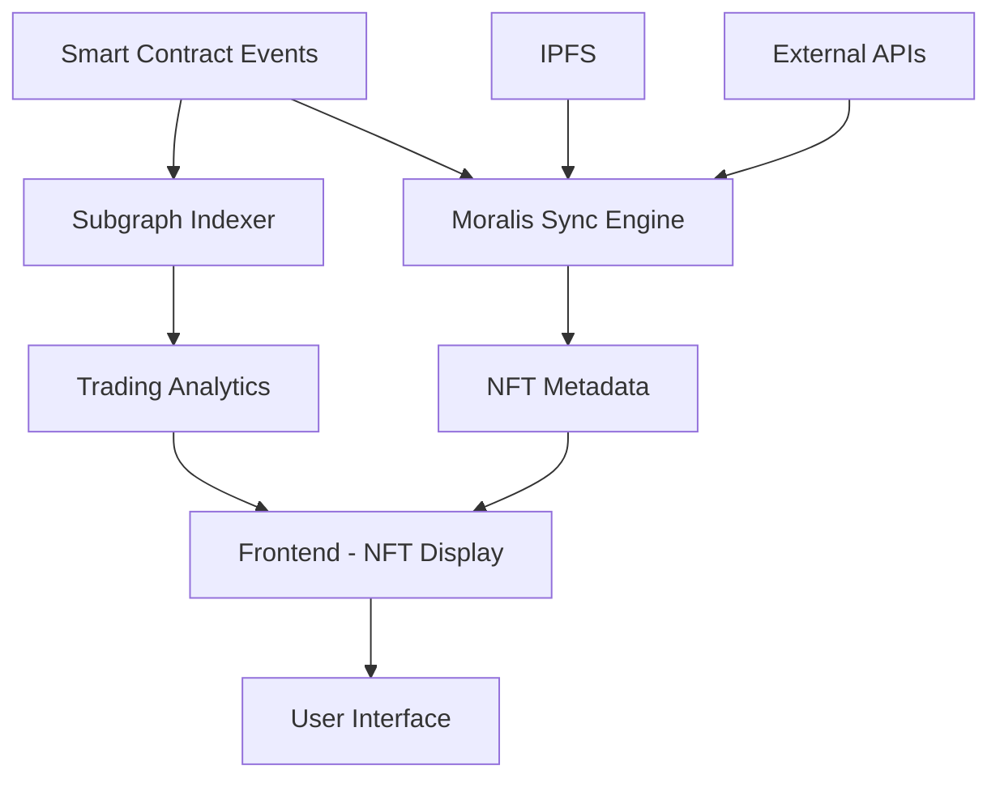

# 🏗️ NFT Marketplace Architecture

## 📊 **Data Layer Strategy**

Dự án sử dụng **hybrid architecture** để tối ưu hiệu suất và chi phí:

### **🎯 Subgraph (The Graph Protocol)**
**Chuyên trách: Trading Analytics & Marketplace Events**

```
✅ SUBGRAPH HANDLES:
- 📈 Trading statistics và volume tracking
- 🔄 Listing/Purchase history 
- 👥 User trading activity & rankings
- 💰 Price tracking và floor price
- 📊 Daily/Weekly marketplace metrics
- 🏆 Leaderboards và analytics
```

**Core Entities:**
- `Listing` - Marketplace listings (active/sold)
- `Purchase` - Sale transactions 
- `User` - Trading statistics per address
- `Collection` - Trading stats per contract
- `MarketplaceStat` - Global marketplace metrics
- `DailyMetric` - Time-series analytics
- `PricePoint` - Price history tracking

### **🚀 Moralis API**
**Chuyên trách: NFT Metadata & Real-time Data**

```
✅ MORALIS HANDLES:
- 🖼️ NFT metadata (name, description, image)
- 🎨 NFT attributes và properties
- 📱 Collection information (name, symbol)
- 👤 Current NFT ownership
- ⚡ Real-time balance updates
- 🌐 Cross-chain NFT data
```

**Moralis Features:**
- NFT API cho metadata
- Real-time sync với blockchain
- IPFS resolution tự động
- Collection discovery
- Wallet portfolio tracking

## 🔄 **Data Flow Architecture**



## 📱 **Frontend Integration Strategy**

### **1. Homepage/Dashboard**
```typescript
// Subgraph: Trading metrics
const { data: stats } = useMarketplaceStats()
const { data: recentSales } = useRecentPurchases()

// Moralis: Featured NFTs với metadata
const featuredNFTs = await Moralis.EvmApi.nft.getWalletNFTs({
  chain: "0x1",
  address: featuredWallet
})
```

### **2. Browse/Marketplace Page**
```typescript
// Subgraph: Active listings (pagination, price filtering)
const { data: listings } = useActiveListings({
  first: 20,
  skip: offset,
  orderBy: "price",
  priceRange: [minPrice, maxPrice]
})

// Moralis: Enrich với metadata
const enrichedListings = await Promise.all(
  listings.map(async (listing) => {
    const metadata = await Moralis.EvmApi.nft.getNFTMetadata({
      address: listing.nftAddress,
      tokenId: listing.tokenId,
      chain: "0x1"
    })
    return { ...listing, ...metadata }
  })
)
```

### **3. NFT Detail Page**
```typescript
// Moralis: NFT metadata và current owner
const nftData = await Moralis.EvmApi.nft.getNFTMetadata({
  address: contractAddress,
  tokenId: tokenId,
  chain: "0x1"
})

// Subgraph: Price history và trading activity
const { data: priceHistory } = usePriceHistory(contractAddress, tokenId)
const { data: tradingHistory } = useTradingHistory(contractAddress, tokenId)
```

### **4. User Profile Page**
```typescript
// Moralis: User's NFT collection
const ownedNFTs = await Moralis.EvmApi.nft.getWalletNFTs({
  chain: "0x1",
  address: userAddress
})

// Subgraph: User trading statistics
const { data: userStats } = useUserTradingStats(userAddress)
```

### **5. Analytics Page**
```typescript
// 100% Subgraph data
const { data: marketStats } = useMarketplaceStats()
const { data: dailyMetrics } = useDailyMetrics()
const { data: topCollections } = useTopCollections()
const { data: topTraders } = useTopTraders()
```

## ⚡ **Performance Optimizations**

### **Caching Strategy**
```typescript
// services/dataService.ts
class DataService {
  // Subgraph data - Cache lâu vì chậm update
  async getMarketplaceStats() {
    return this.cache.get('marketplace-stats', 300) // 5 phút
  }
  
  // Moralis data - Cache ngắn vì real-time
  async getNFTMetadata(address: string, tokenId: string) {
    return this.cache.get(`nft-${address}-${tokenId}`, 60) // 1 phút
  }
}
```

### **Query Optimization**
```typescript
// hooks/useHybridNFTData.ts
export const useHybridNFTData = (contractAddress: string, tokenId: string) => {
  // Parallel queries
  const [
    { data: basicData }, // Subgraph - trading data
    { data: metadata }   // Moralis - metadata
  ] = useQueries([
    useSubgraphNFT(contractAddress, tokenId),
    useMoralisNFT(contractAddress, tokenId)
  ])
  
  return useMemo(() => ({
    ...basicData,
    ...metadata
  }), [basicData, metadata])
}
```

## 💡 **Best Practices**

### **1. Data Separation Principles**
- **Subgraph**: Chỉ blockchain events và computed analytics
- **Moralis**: External data và real-time metadata
- **Frontend**: Business logic và UI state

### **2. Error Handling**
```typescript
const getCompleteNFTData = async (address: string, tokenId: string) => {
  try {
    // Try Subgraph first (cho trading data)
    const tradingData = await getSubgraphData(address, tokenId)
    
    try {
      // Try Moralis for metadata
      const metadata = await getMoralisMetadata(address, tokenId)
      return { ...tradingData, ...metadata }
    } catch (moralisError) {
      // Fallback to IPFS direct
      const fallbackMetadata = await fetchFromIPFS(tradingData.tokenURI)
      return { ...tradingData, ...fallbackMetadata }
    }
  } catch (subgraphError) {
    // Fallback to contract calls
    return await getDirectContractData(address, tokenId)
  }
}
```

### **3. Cost Optimization**
- Subgraph queries: Miễn phí sau khi deploy
- Moralis API: Rate limited, cache aggressively
- Direct RPC calls: Expensive, chỉ dùng khi cần thiết

## 🚀 **Deployment Strategy**

### **Development Environment**
```bash
# Local subgraph
docker-compose up -d
npm run deploy-local

# Moralis setup
# Use testnet endpoints
# Free tier limits
```

### **Production Environment**
```bash
# Subgraph to The Graph Network
npm run deploy-prod

# Moralis Pro Plan
# Production API keys
# CDN caching
```

## 📈 **Monitoring & Analytics**

### **Subgraph Health**
- Sync status monitoring
- Query performance tracking
- Error rate alerts

### **Moralis Usage**
- API quota monitoring  
- Response time tracking
- Rate limit management

### **Frontend Performance**
- Query combination efficiency
- Cache hit rates
- User experience metrics

---

**🎯 Result: Best of both worlds**
- Real-time NFT data từ Moralis
- Historical analytics từ Subgraph  
- Optimal performance và cost efficiency 